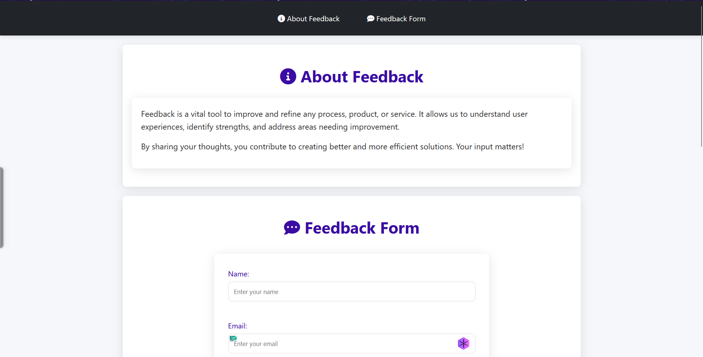

# 📝 Modern Interactive Feedback Form

## [View Live Demo](https://sainath-666.github.io/Form_1/)



## 🎯 Goal

Create a modern, responsive interactive feedback form with rating sliders and an animated thank-you message. The webpage is visually appealing, fully responsive, and interactive with smooth scrolling and navigation features.

## 🏗️ Structure

- **Modern Navbar**: Contains navigation links with icons to scroll to sections.
- **Two Sections**: Clean, card-based design with relevant content tailored to the theme of the page.
- **Responsive Feedback Form**: Includes interactive sliders for user ratings and an animated thank-you message upon submission.

## 💻 Technologies Used

- **HTML5**: For semantic structure with modern elements.
- **CSS3**: For styling with CSS variables, flexbox, and responsive design.
- **JavaScript**: For interactivity including form validation, slider functionality, and animations.
- **Font Awesome**: For modern icons throughout the interface.

## 📦 Deliverables

- Clean, well-structured HTML, CSS, and JavaScript files.
- A fully responsive, visually appealing webpage that works on all devices.
- Modern UI with smooth animations and transitions.


## 🚀 Installation

To view this project locally:

1. Clone the repository:
   ```bash
   git clone https://github.com/sainath-666/Form_1
   ```
2. Open the `index.html` file in your browser.

## ✨ Features

- **Modern UI**: Clean, card-based design with a cohesive color scheme.
- **Interactive Feedback Form**: Users can rate using sliders with real-time value updates.
- **Fully Responsive Design**: The webpage adapts beautifully to all screen sizes from mobile to desktop.
- **Smooth Animations**: Includes transitions, hover effects, and an animated thank-you message.
- **Accessibility**: Designed with accessibility in mind, including proper contrast and semantic HTML.

## 🖱️ Usage

- Open the `index.html` file in a browser.
- Use the navigation bar to smoothly scroll to different sections.
- Fill out the feedback form with your information.
- Adjust the rating sliders to provide your feedback on design, usability, and performance.
- Submit the form to see an animated thank-you message.

## 🧪 Testing

- Tested across multiple browsers (Chrome, Firefox, Safari, Edge).
- Verified responsiveness on various devices from mobile phones to large desktop screens.
- Validated form submission and error handling.
- Ensured all animations and transitions work smoothly.

## 🤝 Contributing

Feel free to fork the repository, submit issues, or create pull requests if you have any suggestions or improvements for the project.


## 📱 Connect with me

- LinkedIn: [sainath666](https://www.linkedin.com/in/sainath666)

---
<div align="center">
  <p>Made with ❤️ by Sainathreddy</p>
</div>
